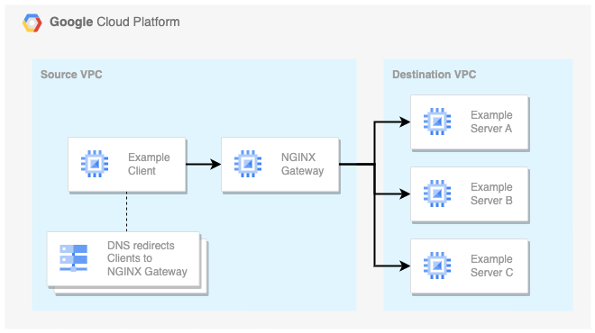

# Use NGINX Gateway To Connect Two VPCs

There are tons of ways to [connect VPCs](https://xebia.com/blog/how-to-setup-network-connectivity-between-vpcs-in-google-cloud/) in Google Cloud. This example deploys an NGINX Gateway VM to allow Source VPC Clients to access resources in the Destination VPC. More specific: clients are redirected to the gateway via custom DNS entries in the Source VPC.



> Read the associated blog post: [How To Use NGINX As A Gateway To Services In Another VPC](https://xebia.com/blog/how-to-use-nginx-as-a-gateway-to-services-in-another-vpc/).

## Deployment

Use Terraform to deploy the example setup.

1. Set the required Terraform variables

    [variables.tf](terraform/variables.tf)

2. Deploy the example infrastructure

    ```bash
    cd terraform
    terraform init
    terraform apply
    ```

3. Try it for yourself

    Log in to the client VM:

    ```bash
    gcloud compute ssh client --tunnel-through-iap --project <project_id>
    ```

    Invoke a service in the destination VPC:

    ```bash
    curl http://example-server.xebia/
    ```

    Invoke an internet url via the gateway:

    ```bash
    curl https://www.google.com/
    ```

    > Note that `.google.com` is added to the Source VPC private DNS zone for demo purposes.

## Clean up

Use Terraform to destroy the example setup.

1. Set the required Terraform variables

    [variables.tf](terraform/variables.tf)

2. Destroy the example infrastructure

    ```bash
    cd terraform
    terraform init
    terraform destroy
    ```